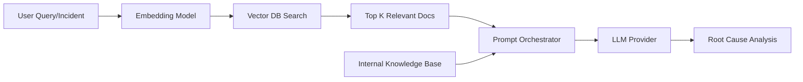

# RAG Pipeline

The Retrieval Augmented Generation pipeline for AI Investigations.

```mermaid
graph LR
    Input[User Query/Incident] --> Embedder[Embedding Model]
    Embedder --> VectorSearch[Vector DB Search]
    VectorSearch --> TopK[Top K Relevant Docs]
    TopK --> PromptBuilder[Prompt Orchestrator]
    Context[Internal Knowledge Base] --> PromptBuilder
    PromptBuilder --> LLM[LLM Provider]
    LLM --> Output[Root Cause Analysis]
```
