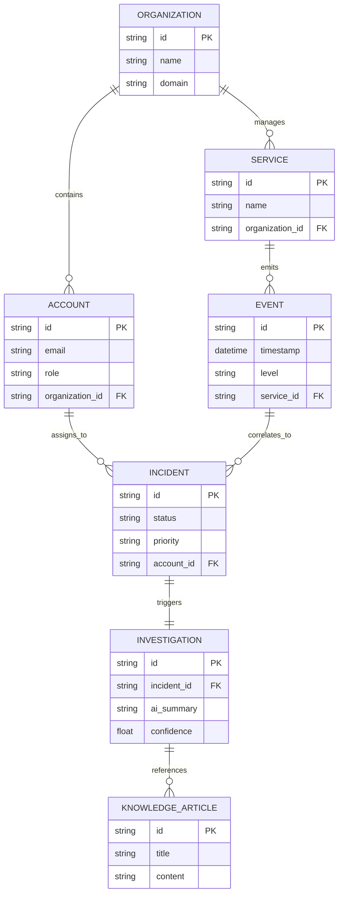

# Entity Relationship Diagram (ERD)

The database schema for OpsPilot AI.

```mermaid
erDiagram
    ORGANIZATION ||--o{ ACCOUNT : contains
    ORGANIZATION ||--o{ SERVICE : manages
    ACCOUNT ||--o{ INCIDENT : assigns_to
    SERVICE ||--o{ EVENT : emits
    EVENT ||--o{ INCIDENT : correlates_to
    INCIDENT ||--|| INVESTIGATION : triggers
    INVESTIGATION ||--o{ KNOWLEDGE_ARTICLE : references
    
    ORGANIZATION {
        string id PK
        string name
        string domain
    }
    ACCOUNT {
        string id PK
        string email
        string role
        string organization_id FK
    }
    SERVICE {
        string id PK
        string name
        string organization_id FK
    }
    EVENT {
        string id PK
        datetime timestamp
        string level
        string service_id FK
    }
    INCIDENT {
        string id PK
        string status
        string priority
        string account_id FK
    }
    INVESTIGATION {
        string id PK
        string incident_id FK
        string ai_summary
        float confidence
    }
    KNOWLEDGE_ARTICLE {
        string id PK
        string title
        string content
    }
```
