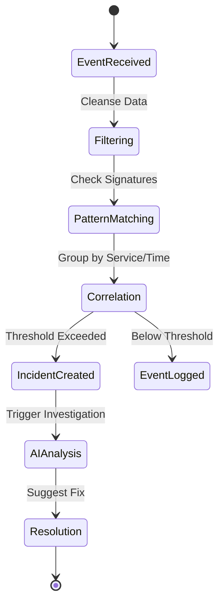

# Activity Diagrams

## Event Correlation Process
How the system correlates raw events into higher-level incidents.

```mermaid
stateDiagram-v2
    [*] --> EventReceived
    EventReceived --> Filtering : Cleanse Data
    Filtering --> PatternMatching : Check Signatures
    PatternMatching --> Correlation : Group by Service/Time
    Correlation --> IncidentCreated : Threshold Exceeded
    Correlation --> EventLogged : Below Threshold
    IncidentCreated --> AIAnalysis : Trigger Investigation
    AIAnalysis --> Resolution : Suggest Fix
    Resolution --> [*]
```
