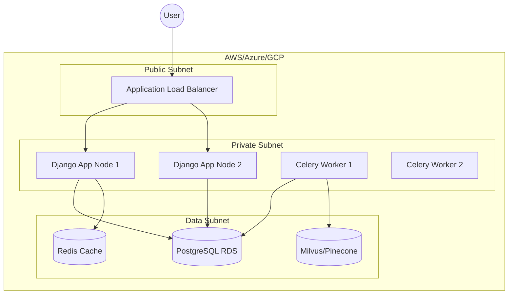

# Deployment Diagram

Infrastructure layout for production deployment.

```mermaid
graph TB
    subgraph Cloud_Provider [AWS/Azure/GCP]
        subgraph Public_Subnet [Public Subnet]
            ALB[Application Load Balancer]
        end
        
        subgraph Private_Subnet [Private Subnet]
            AppSrv1[Django App Node 1]
            AppSrv2[Django App Node 2]
            Worker1[Celery Worker 1]
            Worker2[Celery Worker 2]
        end
        
        subgraph Data_Subnet [Data Subnet]
            RDS[(PostgreSQL RDS)]
            Elasticache[(Redis Cache)]
            VectorDB[(Milvus/Pinecone)]
        end
    end
    
    User((User)) --> ALB
    ALB --> AppSrv1
    ALB --> AppSrv2
    AppSrv1 --> RDS
    AppSrv2 --> RDS
    AppSrv1 --> Elasticache
    Worker1 --> RDS
    Worker1 --> VectorDB
```
