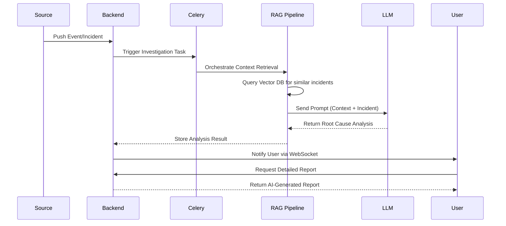

# Sequence Diagrams

## Incident Investigation Flow
The process of an AI investigation from incident detection to root cause analysis.

```mermaid
sequenceDiagram
    participant S as Source
    participant B as Backend
    participant C as Celery
    participant R as RAG Pipeline
    participant L as LLM
    participant U as User

    S->>B: Push Event/Incident
    B->>C: Trigger Investigation Task
    C->>R: Orchestrate Context Retrieval
    R->>R: Query Vector DB for similar incidents
    R->>L: Send Prompt (Context + Incident)
    L-->>R: Return Root Cause Analysis
    R-->>B: Store Analysis Result
    B->>U: Notify User via WebSocket
    U->>B: Request Detailed Report
    B-->>U: Return AI-Generated Report
```
